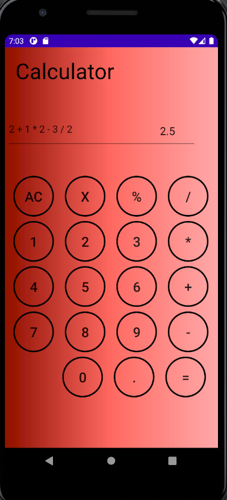
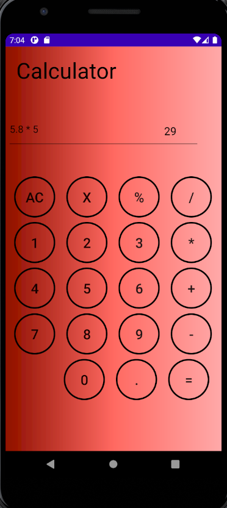

## Calculator App
This is a feature-rich calculator app built using Java in Android Studio. The app allows users to perform basic arithmetic operations such as addition, subtraction, multiplication, and division, while also supporting advanced features like the order of operations (PEMDAS) and decimal numbers.

## Features
Addition: Allows users to add two numbers together.
Subtraction: Allows users to subtract one number from another.
Multiplication: Allows users to multiply two numbers.
Division: Allows users to divide one number by another.
Advanced Calculations: Supports the order of operations (PEMDAS) for complex calculations involving multiple operations and parentheses.
Decimal Numbers: Allows users to enter and calculate with decimal numbers.

Input Validation
The calculator app includes input validation to ensure that numbers and operators are entered correctly. The following checks are implemented:

Number Validation: The app only allows entering numbers when the calculator can accept an operand. This prevents entering multiple numbers consecutively without an operator in between.

Operator Validation: The app ensures that operators can only be entered when a valid operand has been entered before. This prevents starting an expression with an operator or entering consecutive operators.

Dot Operator: The calculator supports decimal numbers by allowing the use of the dot (.) operator. However, the dot operator can only be entered once within a number to maintain valid decimal notation. The app checks and restricts the use of multiple dots within a single number.

## Requirements
Android Studio
Java Development Kit (JDK)
Android SDK

## Installation
Clone the repository or download the source code.
Open Android Studio.
Click on "Open an existing Android Studio project" and select the project folder.
Wait for the project to load and synchronize.
Connect an Android device or create a virtual device using the Android Virtual Device (AVD) Manager.
Build and run the project on the device.

## Usage
Launch the Calculator app on your Android device.
Enter the numbers and operations using the provided buttons. You can use both whole numbers and decimal numbers.
Click the "=" button to perform the calculation.
The result will be displayed on the screen.

## Screenshots

##Operations:

##Decimal Numbers:

